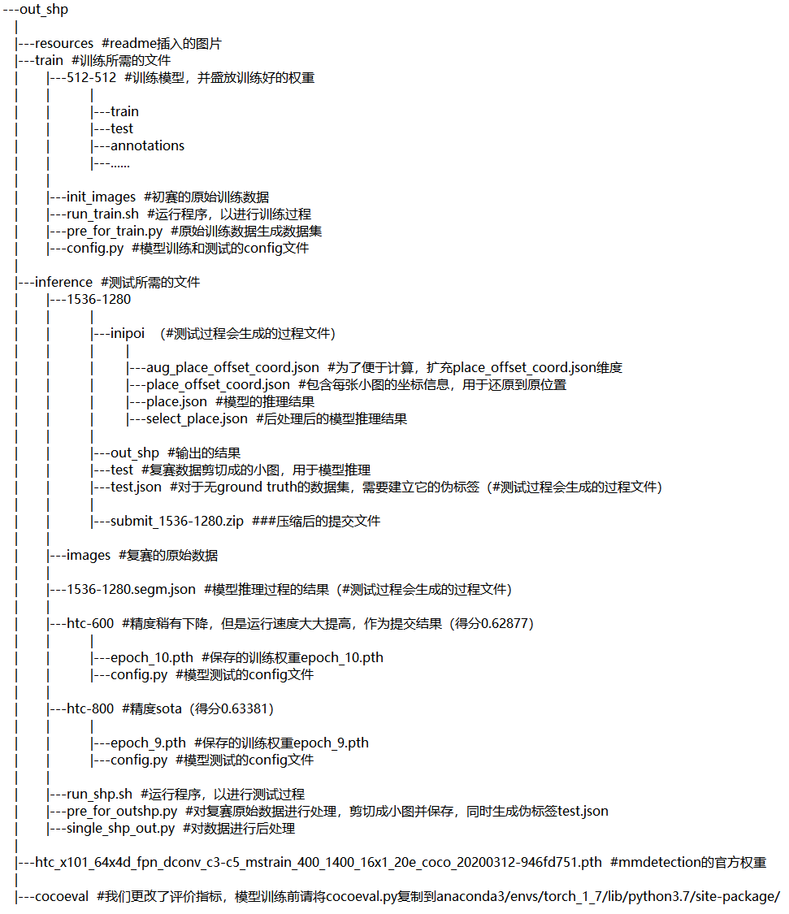
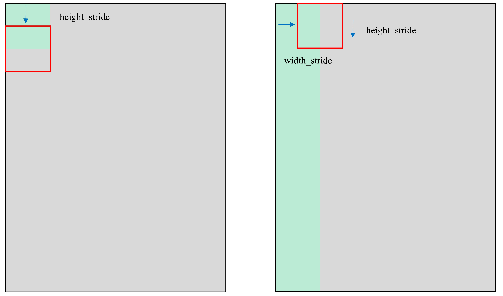
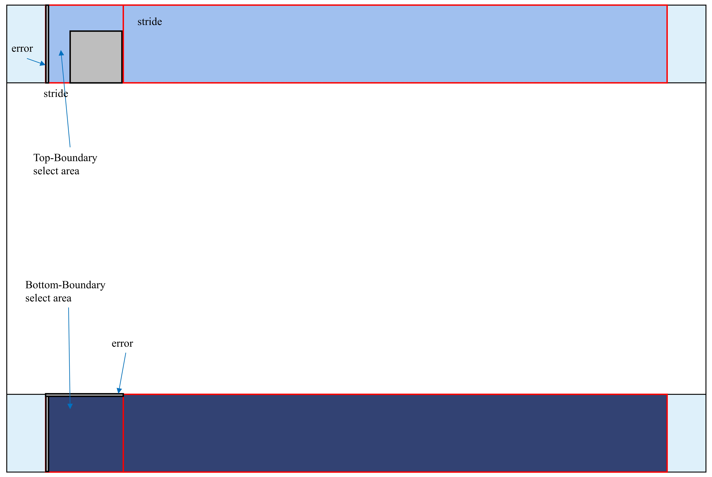
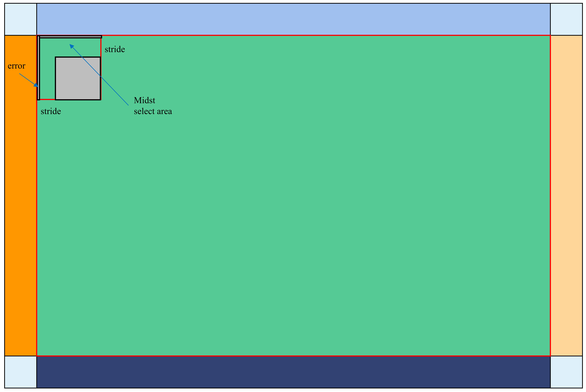

# The-iFLYTEK-2021-Cultivatedland-Extraction-From-High-Resolution-Remote-Sensing-Image-Challenge
Our code was developed based on the mmdetection
## 0. Dataset
Thanks iFLYTEK and ChangGuang Satellite.

All images and their associated annotations in the dataset can be used for academic purposes only, but any commercial use is prohibited.

dataset are available at:
链接：https://pan.baidu.com/s/1_yFbJ6nX1ovOK0_9BZ5Lrg?pwd=1234 
提取码：1234

## 1. 环境配置

本地运行的环境配置是针对linux系统和2080Ti显卡，如果测试时，遇到环境配置不符合，还请再联系

- **1. pytorch安装**

  下载anaconda

  ``` shell
  wget https://mirrors.tuna.tsinghua.edu.cn/anaconda/archive/Anaconda3-2020.11-Linux-x86_64.sh
   ```
  安装anaconda

  ``` shell
  chmod +x Anaconda3-2020.11-Linux-x86_64.sh
  ./Anaconda3-2020.11-Linux-x86_64.sh
   ```
  创建虚拟环境torch_1_7

  ``` shell
  conda create -n torch_1_7 python=3.7
   ```
  进入虚拟环境torch_1_7

  ``` shell
  conda activate torch_1_7
   ```
  安装pytorch

  ``` shell
  conda install pytorch=1.7.0 torchvision torchaudio cudatoolkit=10.2 -c pytorch
   ```
  3080Ti显卡需要CUDA11.0及以上，安装pytorch版本如下

  ``` shell
  conda install pytorch=1.7.0 torchvision torchaudio cudatoolkit=11.0 -c pytorch
   ```
- **2. mmdetection安装**
 
  安装MMDetection和MIM，它会自动处理OpenMMLab项目的依赖，包括mmcv等python包 
  
  ``` shell
  pip install openmim
  mim install mmdet
   ```
  可能出现找不到dist_train.sh和dist_test.sh的情况，请先运行
  
  ``` shell
  cd mmdetection
  chmod 777 ./tools/dist_train.sh
  chmod 777 ./tools/dist_test.sh
   ```
  MMDetection 是一个基于 PyTorch 的目标检测开源工具箱。它是 [OpenMMLab](https://openmmlab.com/) 项目的一部分。
  MMDetection安装文档：[快速入门文档](docs/get_started.md)

- **3. 必须的函数包安装**
  
  安装sklearn
  ``` shell
  pip install sklearn
   ```
  安装imgaug
  ``` shell
  pip install imgaug
   ```
  安装shapefile
  ``` shell
  pip install pyshp
   ```
  安装tqdm
  ``` shell
  pip install tqdm
   ```
  安装gdal
  ``` shell
  conda install -c conda-forge gdal
   ```
  安装shapely
  ``` shell
  pip install shapely
   ```
  安装skimage
  ``` shell
  pip install scikit-image
   ```
## 2. 运行说明
- **文件说明**

  文件结果如图所示,请您在训练前将初赛的原始数据复制到train/init_images内，tif文件直接放在image文件夹下，shp文件直接放在label文件夹下；\
  测试前将复赛数据tif文件直接复制到inference/images内



- **训练过程**
  训练开始前，我们使用mmdetection提供的官方权重。为了方便您的训练，我们已经将其下载到mmdetection/out_shp中
  ``` shell
  cd mmdetection/out_shp
  wget https://download.openmmlab.com/mmdetection/v2.0/htc/htc_x101_64x4d_fpn_dconv_c3-c5_mstrain_400_1400_16x1_20e_coco/htc_x101_64x4d_fpn_dconv_c3-c5_mstrain_400_1400_16x1_20e_coco_20200312-946fd751.pth
   ```
  回到mmdetection目录开始训练，{GPU_NUM}为使用GPU的显卡个数
  ``` shell
  cd ..
  source out_shp/train/run_train.sh ${GPU_NUM}
   ```
  
- **测试过程**
  
  需要根据根据训练的log文件，选择最佳的权重。您也可以使用我们保存的训练权重进行测试out_shp/inference/htc-600/epoch_10.pth\
  可进入mmdetection目录下，直接运行下面的程序，将直接生成提交结果out_shp/inference/submit_1536-1280.zip
  ``` shell
    source out_shp/inference/run_shp.sh ${GPU_NUM}
   ```
## 3. 数据前处理

- **选择4通道tif文件的RGB三个通道输出小图数据**


- **运用如下图所示的滑窗剪切图片，首先以height_stride的步长向下移动，直至达到图片的下边界，然后以width_stride向右平移一单位，继续以height_stride的步长向下移动，以剪切出小图组成数据集**
  


- **当滑窗的下边界超出图片的下边界时，停止移动，以图片的下边界作为滑窗的下边界；当滑窗的右边界超出图片的右边界时，停止移动，以图片的右边界作为滑窗的右边界；**


- **在所有滑窗中随机采样组成训练集和验证集，训练集和验证集比例为5:1**


- **在训练与测试模型时，滑窗尺寸为512 x 512，height_stride与width_stride均为512 (滑窗不重叠)**


- **在使用模型输出提交结果时，滑窗尺寸为1536 x 1536，height_stride与width_stride均为1280，然后在后处理过程中运用边界筛选法去除图片重叠的影响**


## 4. 模型Hybrid Task Cascade (HTC)

Implementation of `HTC <https://arxiv.org/abs/1901.07518>`


- **HTC结构将bbox回归和mask预测交织进行，在每个阶段中以多任务的方式将两者结合，增强了不同任务之间的信息流**


- **在不同阶段之间，引入直接连接，将前一阶段的mask预测直接传给当前mask，增强了不同阶段之间的信息流**


- **加入了一个语义分割分支，并将其与bbox分支和mask分支融合，旨在挖掘跟多的上下文信息**


## 5. 数据的后处理

为了解决原始图片被剪切成各个小图时，相关的耕地目标也被切分成了多个部分的问题。我们使用了边界筛选法对预测结果进行后处理

- **1. 我们设置滑窗尺寸为1536 x 1536，height_stride与width_stride均为1280，以保证每块耕地目标至少会完整的出现在其中一个滑窗之中**


- **2. 因为滑窗从上向下，从左向右剪切，当滑窗的下或右边界超出图片的下或右边界时，以图片的下边界和右边界作为滑窗的下边界和右边界，
  所以在图片的下边界一行处的滑窗的框高imageHeight可能小于标准框高1536，右边界一列处的滑窗的框宽imageWidth可能小于标准框宽1536**
  

- **3. place_offset_coord.json文件记录了每个滑窗左上角顶点的坐标(xmin,ymin)，在图片的左边界处，滑窗xmin = 0，在图片的上边界处，滑窗ymin = 0。
  通过(imageHeight, imageWidth, xmin, ymin)可以判断出每一个滑窗的位置**
  

- **4. (1)我们定义基础select area为滑窗向下和向右移动一个stride形成的多边形区域，当小图中的预测mask的bbox的左上角的坐标(bboxx, bboxy)落在图中的select area中时则认为耕地目标完整出现在本滑窗中，否则认为耕地目标不完整予以舍弃。\
  (2)我们定义靠近滑窗左边界或上边界2个像素的区域内为error区域，如果bbox的左上角顶点落在error区域内，我们认为这个bbox内的耕地目标很大概率是被截断的、不完整的。\
  (3)位于原始图片的上边界和左边界的滑窗，其上边界或左边界没有来自前者的重叠图片，则不舍弃error区域；位于原始图片的下边界和右边界的滑窗，其下边界或右边界没有后续的重叠图片，则合并结果，仅减去error区域。**
  
### 图片各个滑窗的位置判断与区域选择
#### 四个角处的滑窗
Top-Left：(imageHeight = 1536, imageWidth = 1536, xmin = 0, ymin = 0)\
Bottom-Left：(imageHeight < 1536, imageWidth = 1536, xmin = 0, ymin ≠ 0)\
Top-Right：(imageHeight = 1536, imageWidth < 1536, xmin ≠ 0, ymin = 0)\
Bottom-Right：(imageHeight < 1536, imageWidth < 1536)
  


#### 四条边界处的滑窗(不包含四个角)
Left-Boundary：(imageHeight = 1536, imageWidth = 1536, xmin = 0, ymin ≠ 0)\
Right-Boundary：(imageHeight = 1536, imageWidth < 1536, xmin ≠ 0, ymin ≠ 0)\
Top-Boundary：(imageHeight = 1536, imageWidth = 1536, xmin ≠ 0, ymin = 0)\
Bottom-Boundary：(imageHeight < 1536, imageWidth = 1536, xmin ≠ 0, ymin ≠ 0)




#### 图片中部处的滑窗
Midst：(imageHeight = 1536, imageWidth = 1536, xmin ≠ 0, ymin ≠ 0)

 
   
